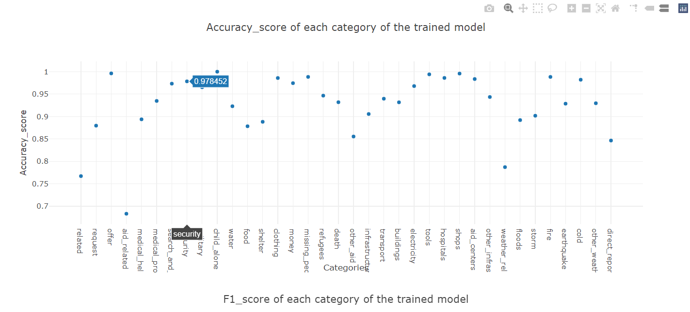

# DisasterResponses

1. Installation
2. Project Motivation
3. File Description
4. How to run the file and Web app?
5. Results
6. Licensing, Authors, and Acknowledgements

# Installation:
The code should run with no issues using Python versions 3.* Libraries such as Sklearn, nltk and flask would be required. Pickle and sqlalchemy libraries will be required to store the model and connect to a SQL database.

# Project Motivation:
Following a disaster, typically there are millions and millions of communication either direct or via social media right at the time when the disaster response orgranizations have the least capacity to filter and pull the messages which are most important. Typically 1 in 1000 messages are important to the people at such organizations. FigureEight have build a dataset containing real messages that were sent during disaster events and categorize them into different categories.

Inorder to tackle this problem, a supervised learning model can be build to categorize these events so that the user can send the messages to an appropriate disaster relief agency. The problem has been decided into three parts:

1. ETL pipeline:
In a Python script, process_data.py, a data cleaning pipeline is written that:

* Loads the messages and categories datasets
* Merges the two datasets
* Cleans the data
* Stores it in a SQLite database

2. Machine Leanring Pipeline:
In a Python script, train_classifier.py, a machine learning pipeline is written that:

* Loads data from the SQLite database
* Splits the dataset into training and test sets
* Builds a text processing and machine learning pipeline
* Trains and tunes a model using GridSearchCV
* Outputs results on the test set
* Exports the final model as a pickle file

3. Flask Web App: 
* An app will be created where an emergency worker can input a new message and get classification results in several categories. The web app will also display visualizations of the data. 

# File Description:

* app folder consists of the file run.py which is used to run the application. It also contains the templates for making an similar application.
* data folder consists of the csv files and process_data.py file which contains the ETL pipeline. 
* models folder consists of the train_classifier.py file which contains the ML pipeline. Other files will be stored on the running the file.

# How to run the file and the Web app?

1. Run the following commands in the project's root directory to set up your database and model.

    - To run ETL pipeline that cleans data and stores in database
        `python data/process_data.py data/disaster_messages.csv data/disaster_categories.csv data/DisasterResponse.db`
    - To run ML pipeline that trains classifier and saves
        `python models/train_classifier.py data/DisasterResponse.db models/classifier.pkl`

2. Run the following command in the app's directory to run your web app.
    `python run.py`
    
    Now, open another Terminal Window. Type
    `env|grep WORK`
    
    In a new web browser window, type in the following:
    `https://SPACEID-3001.SPACEDOMAIN`
    
 # Results: 
 
 The model has been trained on the dataset. Note that the dataset is not uniform across all possible fields i.e. For some fields it has more data points than other fields. Thus, the model may be baised towards some categories. 
 
 The following are the results for the accuracies of the model for each message category: 
 
 
 

